# Stage 3
### DDL
**Create Table**
```
CREATE TABLE IF NOT EXISTS User (
    name VARCHAR(255) PRIMARY KEY
);
```
```
CREATE TABLE IF NOT EXISTS PC (
    PC_ID INT,
    owner VARCHAR(255) NOT NULL,
    CPU_Name VARCHAR(255),
    Cooler_Name VARCHAR(255),
    Motherboard_Name VARCHAR(255),
    Storage_Name VARCHAR(255),
    Memory_Name VARCHAR(255),
    GPU_Name VARCHAR(255),
    PowerSupply_Name VARCHAR(255),
    Estimated_Cost DECIMAL(10, 2),
    Price DECIMAL(10, 2),
    PRIMARY KEY (PC_ID, owner),
    FOREIGN KEY (owner) REFERENCES User(name)
);
```
```
CREATE TABLE IF NOT EXISTS CPU (
    CPU_Name VARCHAR(255),
    Manufacturer VARCHAR(255),
    Series VARCHAR(255),
    Microarchitecture VARCHAR(255),
    Core_Family VARCHAR(255),
    CPU_Socket VARCHAR(255),
    Core_Count INT,
    Thread_Count INT,
    Performance_Core_Clock VARCHAR(255),
    Performance_Core_Boost_Clock VARCHAR(255),
    L2_Cache VARCHAR(255),
    L3_Cache VARCHAR(255),
    TDP INT,
    Integrated_Graphics VARCHAR(255),
    Maximum_Supported_Memory VARCHAR(255),
    ECC_Support VARCHAR(255),
    Includes_Cooler VARCHAR(255),
    Includes_CPU_Cooler VARCHAR(255),
    Lithography VARCHAR(255),
    Simultaneous_Multithreading VARCHAR(255),
    Price DECIMAL(10, 2),
    PRIMARY KEY (CPU_Name)
);
```
```
CREATE TABLE IF NOT EXISTS CPU_Cooler (
    Cooler_Name VARCHAR(255),
    Manufacturer VARCHAR(255),
    Model VARCHAR(255),
    Fan_RPM VARCHAR(255),
    Noise_Level VARCHAR(255),
    Height INT,
    Water_Cooled BOOL,
    Fanless BOOL,
    Price DECIMAL(10, 2),
    PRIMARY KEY (Cooler_Name)
);
```
```
CREATE TABLE IF NOT EXISTS GPU (
    GPU_Name VARCHAR(255),
    Manufacturer VARCHAR(255),
    Chipset VARCHAR(255),
    Memory INT,
    Memory_Type VARCHAR(255),
    Core_Clock INT,
    Boost_Clock INT,
    Interface VARCHAR(255),
    Frame_Sync VARCHAR(255),
    Length INT,
    TDP INT,
    Case_Expansion_Slot_Width INT,
    Total_Slot_Width INT,
    Cooling VARCHAR(255),
    External_Power VARCHAR(255),
    HDMI_21_Outputs INT,
    DisplayPort_14_Outputs INT,
    Price DECIMAL(10, 2),
    PRIMARY KEY (GPU_Name)
);
```
```
CREATE TABLE IF NOT EXISTS RAM (
    Memory_Name VARCHAR(255),
    Manufacturer VARCHAR(255),
    Speed VARCHAR(255),
    Form_Factor VARCHAR(255),
    Modules VARCHAR(255),
    First_Word_Latency DECIMAL(10, 5),
    CAS_Latency DECIMAL(10, 5),
    Voltage DECIMAL(10, 5),
    Timing VARCHAR(255),
    ECC_Registered VARCHAR(255),
    Heat_Spreader BOOL,
    Price DECIMAL(10, 2),
    PRIMARY KEY (Memory_Name)
);
```
```
CREATE TABLE IF NOT EXISTS Motherboard (
    Motherboard_Name VARCHAR(255),
    Manufacturer VARCHAR(255),
    Socket VARCHAR(255),
    Form_Factor VARCHAR(255),
    Chipset VARCHAR(255),
    Memory_Max INT,
    Memory_Type VARCHAR(255),
    Memory_Slots VARCHAR(255),
    Memory_Speed VARCHAR(255),
    PCIe_x16_Slots INT,
    PCIe_x8_Slots INT,
    PCIe_x4_Slots INT,
    PCIe_x1_Slots INT,
    PCI Slots INT,
    M2_Slots INT,
    Mini_PCIe_mSATA_Slots INT,
    Half_Mini_PCIe_Slots INT,
    Mini_PCIe_Slots INT,
    mSATA_Slots INT,
    SATA6_Gbs INT,
    Onboard_Ethernet VARCHAR(255),
    Onboard_Video VARCHAR(255),
    USB_2_0_Headers INT,
    USB_2_0_Headers_Single_Port INT,
    USB_3_2_Gen_1_Headers INT,
    USB_3_2_Gen_2_Headers INT,
    USB_3_2_Gen_2x2_Headers INT,
    Supports_ECC BOOL,
    Wireless_Networking VARCHAR(255),
    RAID_Support BOOL,
    Uses_Back_Connect_Connectors BOOL,
    Price DECIMAL(10, 2),
    PRIMARY KEY (Motherboard_Name)
);
```
```
CREATE TABLE IF NOT EXISTS PowerSupply (
    PowerSupply_Name VARCHAR(255),
    Manufacturer VARCHAR(255),
    Model VARCHAR(255),
    Type VARCHAR(255),
    Efficiency_Rating VARCHAR(255),
    Wattage INT,
    Length INT,
    Modular VARCHAR(255),
    Fanless BOOL,
    ATX_4_Pin_Connectors INT,
    EPS_8_Pin_Connectors INT,
    PCIe_12_4_Pin_12VHPWR_Connectors INT,
    PCIe_12_Pin_Connectors INT,
    PCIe_8_Pin_Connectors INT,
    PCIe_6_2_Pin_Connectors INT,
    PCIe_6_Pin_Connectors INT,
    SATA_Connectors INT,
    Molex_4_Pin_Connectors INT,
    Price DECIMAL(10, 2),
    PRIMARY KEY (PowerSupply_Name)
);
```
```
CREATE TABLE IF NOT EXISTS Storage (
    Storage_Name VARCHAR(255),
    Manufacturer VARCHAR(255),
    Capacity DECIMAL(10, 4),
    Type VARCHAR(255),
    Form_Factor VARCHAR(255),
    Interface VARCHAR(255),
    NVME BOOL,
    Price DECIMAL(10, 2),
    PRIMARY KEY (Storage_Name)
);
```
**Connection and row counts**

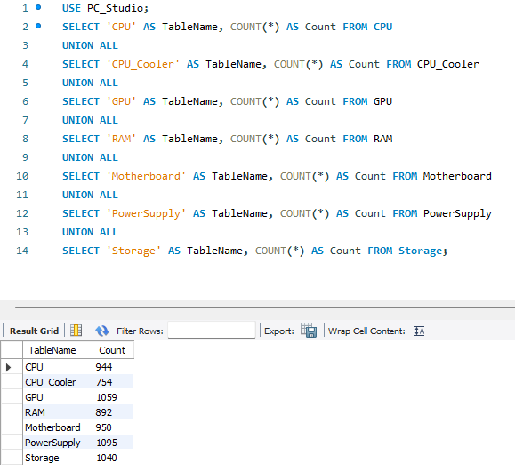

**Advanced SQL queries**
##### Prompt 1:
The user wants to know more about storages that provides NVME compatibility, so the user wants to know the number of storage products of each manufacturer that supports NVME, while also have a capacity greater than or equal to the average capacity of that manufacturer.
##### Query 1:
```
SELECT Storage.Manufacturer, COUNT(Storage.Storage_Name) AS Storage_Count
FROM Storage
WHERE Storage.NVME = TRUE
  AND Storage.Capacity >= (
      SELECT AVG(Capacity)
      FROM Storage AS S2
      WHERE S2.Manufacturer = Storage.Manufacturer
  )
GROUP BY Storage.Manufacturer
LIMIT 15;
```
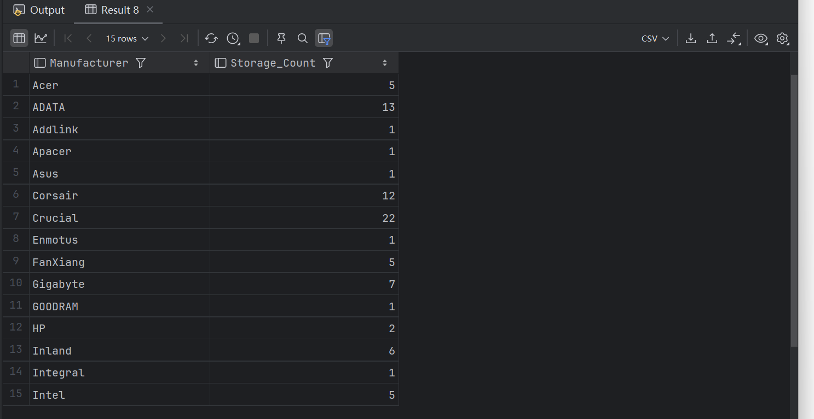
##### Prompt 2:
The user wants to know all the CPUs compatible with ASRock’s motherboards, as well as all the CPUs that have >= 4 cores and >= 4 threads
##### Query 2:
```
SELECT CPU.CPU_Name
FROM CPU
JOIN (
       SELECT * FROM Motherboard
       WHERE Manufacturer = 'ASRock'
) AS M
ON CPU.CPU_Socket = M.Socket

UNION

SELECT CPU.CPU_Name
FROM CPU
WHERE Core_Count >= 4 AND Thread_Count >= 4;
```
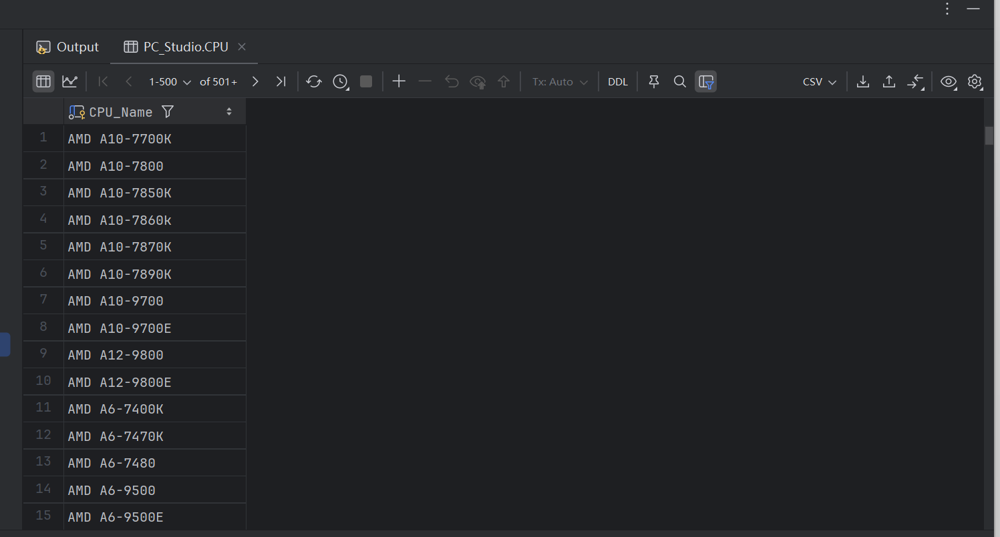
##### Prompt 3:
The user want to know the CPUs with their compatible motherboards, Which should have high-performance with above-average TDP and work with multiple motherboards
##### Query 3:
```
SELECT DISTINCT CPU.CPU_Name, CPU.Manufacturer, CPU.TDP, Motherboard.Motherboard_Name, Motherboard.Manufacturer
FROM PC_Studio.CPU
JOIN PC_Studio.Motherboard ON CPU.CPU_Socket = Motherboard.Socket
WHERE CPU.TDP > (SELECT AVG(TDP) FROM PC_Studio.CPU) and 
    CPU.CPU_Name in (SELECT CPU.CPU_Name
                     FROM PC_Studio.CPU
                     JOIN PC_Studio.Motherboard ON CPU.CPU_Socket = Motherboard.Socket
                     GROUP BY CPU.CPU_Name
                     HAVING COUNT(Motherboard.Motherboard_Name) > 1)
ORDER BY CPU.TDP DESC
LIMIT 15;
```
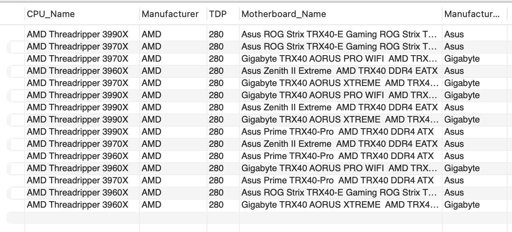
##### Prompt 4:
The user want to know CPUs and GPUs with TDP values above their respective averages and combines the results.
##### Query 4:
```
SELECT 'CPU' AS Component, CPU.CPU_Name AS Component_Name, CPU.Manufacturer AS Manufacturer, CPU.TDP AS TDP
FROM PC_Studio.CPU
WHERE CPU.TDP > (SELECT AVG(TDP) FROM PC_Studio.CPU)

UNION

SELECT 'GPU' AS Component, GPU.GPU_Name AS Component_Name, GPU.Manufacturer AS Manufacturer, GPU.TDP AS TDP
FROM PC_Studio.GPU
WHERE GPU.TDP > (SELECT AVG(TDP) FROM PC_Studio.GPU)

ORDER BY TDP DESC
LIMIT 15;
```


**Indexing**
#### Query 1:

##### EXPLAIN ANALYZE
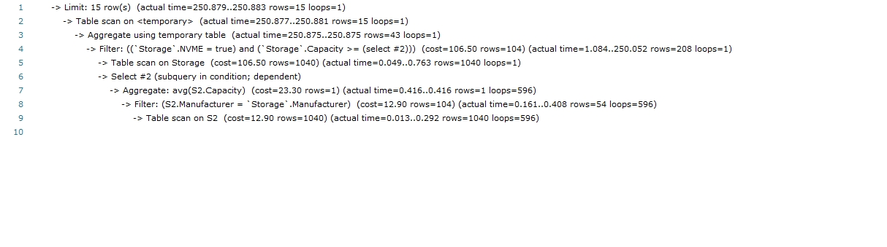
##### Index to ```Storage.NVME```
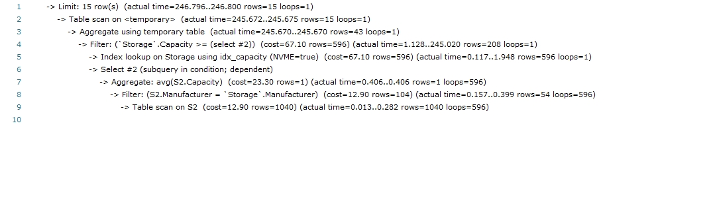
The cost of ```Filter``` reduces from 106.50 to 67.10. Without this index, a full table scan is required to check every ```Storage.NVME``` to see if it is ```True``` while this index allows the query to directly find those are desired, ```NVME=True```, as the result, the cost is reduced by fewer row access.

##### Index to ```Storage.Capacity```
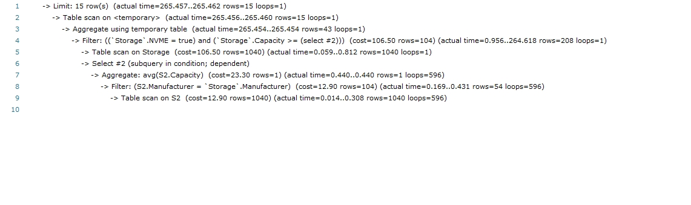
There does not appear any improvement with this indexinyg as the cost remains at 106.50. This is likely due to the comparision to ```AVG(Capcity)``` in subquery, resulting a need for full table scan, nothing can be narrow down in this case.

##### Index to ```Storage.Manufacturer```
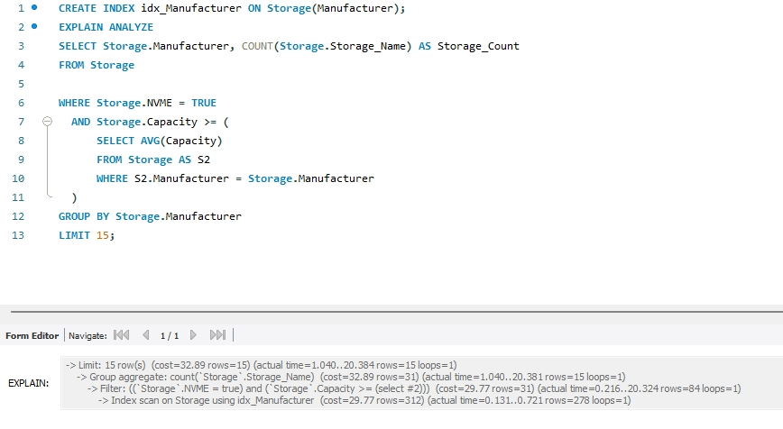
The cost is significantly reduced from 106.50 to 32.89 with this indexing. Firstly, at Index scan on Storage, the cost is now 29.77 when grouping entries using ```Manufacturer```. Secondly, the sub-query can also be benefited where ```S2.Manufacturer = Storage.Manufacturer``` can find matches more quickly just like the case of ```NVME``` directly finding those are ```True```, as a result, the aggregation cost drops from 23.30 to 9.36 and table scan of 12.90 to index lookup with 7.28 

##### Selected index: ```Storage.Manufacturer```
The cost with this index is the lowest. Among the 3 attributes (```Storage.NVME```, ```Storage.Capacity```, ```Storage.Manufacturer```), its high cardinality helps reduce cost for search, especially with the query grouping entries by it, comparing to *NVME*, boolean, which also reduces the cost, but not that significant. While, as discussed earlier, ```Storage.Capacity``` does not help, resulting the most optimal choice being ```Storage.Manufacturer```

#### Query 2:

##### EXPLAIN ANALYZE
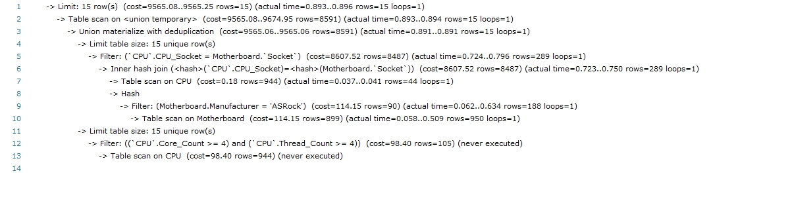

##### Index to ```Motherboard.Manufacturer```
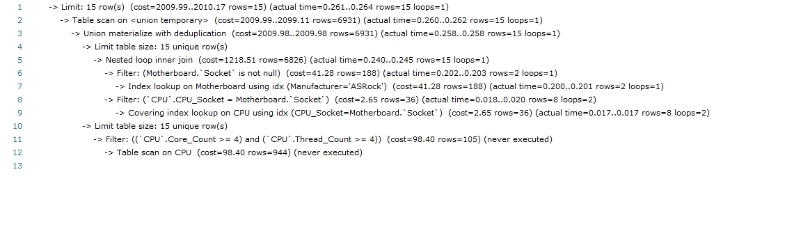
Tried adding index to ```Motherboard.Manufacturer```, because it is an attribute used in where statement in subquery. Turns out decreased the cost from 9565.08 to 2009.99. Result suggests this is by now the best indexing.

##### Index to ```CPU.CPU_Socket```
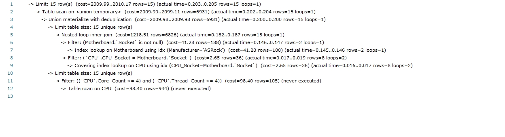
Tried adding index to ```CPU.CPU_Socket```, because it is an attribute used in join-on two tables. Turns out decreased the cost from 9565.08 to 2009.99. Result suggests this has the same effect as indexing ```Motherboard.Manufacturer```.

##### Index to ```Motherboard.Socket```

Tried adding index to ```Motherboard.Socket```, because it is an attribute used in join-on two tables similar to ```CPU.CPU_Socket```. Turns out the cost is reduced from 9565.08 to 1112.40. Result suggests this is by now the best indexing.

##### Index to ```CPU.Core_Count```
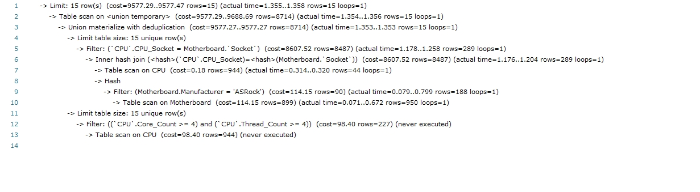
Tried adding index to ```CPU.Core_Count```, because it is an attribute used in where statement. But turns out it does not increased the cost but rather increase a tiny bit to 9577.29. Result suggests this is obviously not the best indexing.

##### Index to ```CPU.Thread_Count```
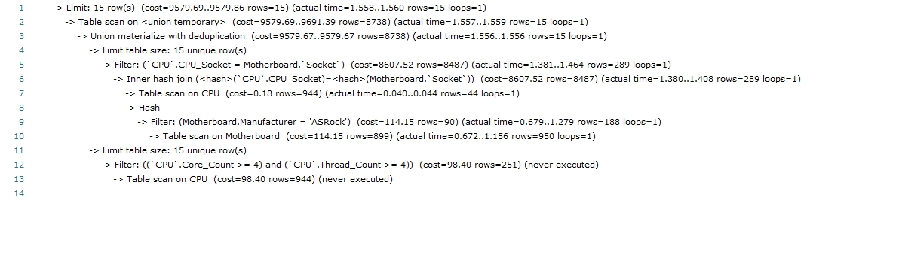
Tried adding index to ```CPU.Thread_Count```, because it is an attribute used in where statement. But turns out it does not increased the cost but rather increase a tiny bit to 9579.69. Result suggests this is obviously not the best indexing.

##### Selected index: ```Motherboard.Socket```
Results suggests the cost with this index is the lowest among all the 5 attributes (```Motherboard.Manufacturer```, ```CPU.CPU_Socket```, ```Motherboard.Socket```, ```CPU.Core_Count```, ```CPU.Thread_Count```) listed above. Indexing it help reduce cost for join-on, comparing to indexing the other join-on attribute (```CPU.CPU_Socket```) or the where attribute (```Motherboard.Manufacturer```), indexing ```Motherboard.Socket``` has a higher amount of decreasing. On the other hand, indexing the rest two attributes (```CPU.Core_Count```, ```CPU.Thread_Count```) both increased the cost by a tiny amount, so considering all the facts above, indexing (```Motherboard.Socket```) is the best indexing design.

#### Query 3:


##### EXPLAIN ANALYZE
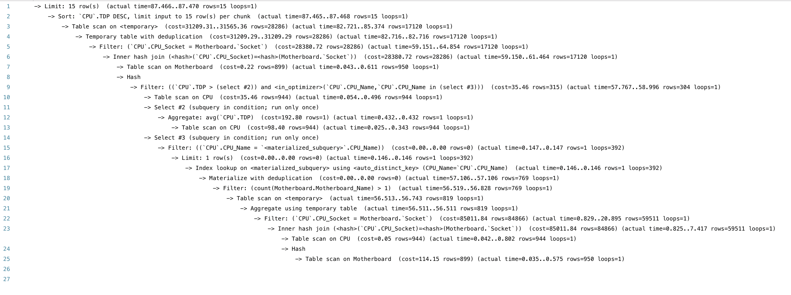


##### Index to ```CPU.Manufacturer```
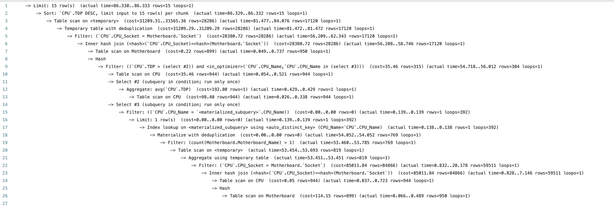
With the index of ```Manufacturer```, the cost of these operations remain the same since we just output these values and haven't used these columns for operation performance. It is not involved in filtering, joining, etc such operations which will be benefited from index. It won't help optimize the cost for scanning and nested inner join loop or directly affect the performance.


##### Index to ```CPU.TDP ```
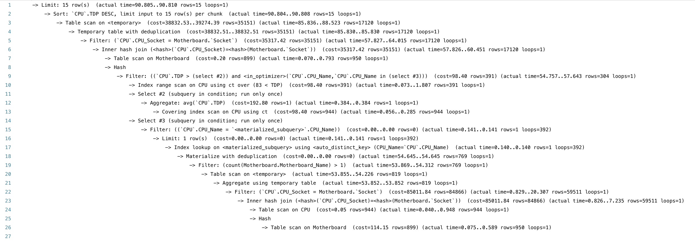
With the index of ```CPU.TDP ```, the cost of the operations remain the same except the filter which finds the CPU with TDP above the average. For this filter, the cost increase from 35.46 to 98.40. It could be due to the additional overhead estimated using the index of ```CPU.TDP ```. And since this index isnt highly selective to help skip many of the rows. It therefore become less efficient.


##### Index to ```CPU.CPU_Socket``` 
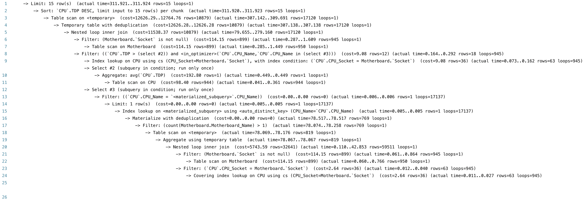
With the index of ```CPU.CPU_Socket ```, the cost of table scan significantly decrease from 31209 to 12626. This is because the query is filter by joining on ```CPU.CPU_Socket``` = ```Motherboard.Socket```. It allows the database to quickly find the matching rows without scanning the entire table and therefore reduces the number of rows it has to process during the scan.


##### Index to ```Motherboard.Manufacturer```
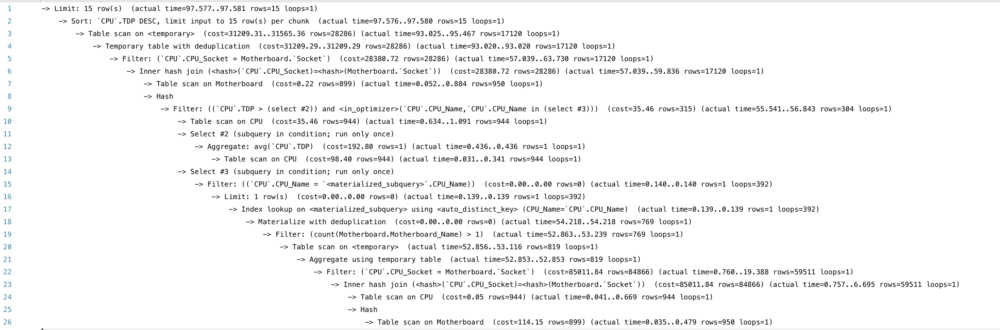
Similar to ```CPU.Manufacturer```, the cost of these operations remains the same since we just output these values and haven't used these columns for operation performance. It won't help optimize the cost for scanning or nested inner join loop and cannot directly affect the performance.


##### Index to ```Motherboard.Socket```
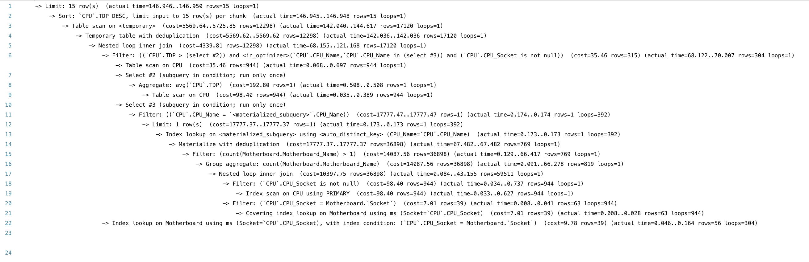
With the index of ```Motherboard.Socket```, the cost of table scan significantly decrease from 31209 to 5569. This is because the query is filter by joining on ```CPU.CPU_Socket``` = ```Motherboard.Socket```. It allows the database to quickly find the matching rows without scanning the entire table and therefore reduces the number of rows it has to process during the scan.


##### Selected index: ```Motherboard.Socket```
The final index design should be for ```Motherboard.Socket```. This index significantly reduced the cost of scanning the entire Motherboard table. Indexing ```Motherboard.Socket``` allows the database to quickly match rows in both tables and therefore improve the efficiency.

#### Query 4:

##### EXPLAIN ANALYZE


##### Index to ```CPU.TDP```
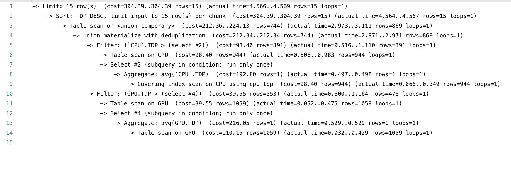
The cost of limit, sort, filter, and scan of union temporary, however, increases significantly. For example, the cost of limit and sort increase from 225.23 to 304.39. It is due to the duplication in order and union operation. Since in this query, no nested inner loop join is needed, adding such index cannot optimize the operation cost. ```CPU.TDP``` could also often duplicate value. If the index doesn't cover the specific query requirements, using an index could result in greater cost.


##### Index to ```GPU.TDP```

Similar to ```CPU.TDP```, the cost of these operations significantly increases. or example, the cost of limit and sort increase from 225.23 to 304.39.  Since there is no nested inner loop required, adding index in this query isn't a optimized choice and even increase the overhead during scanning. 


##### Index to ```CPU.Manufacturer ```
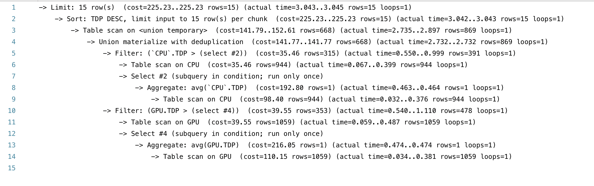
With the index of ```Manufacturer```, the cost of these operations remain the same since we just output these values and haven't used these columns for operation performance. It won't help optimize the scanning and nested inner join loop.


##### Index to ```GPU.Manufacturer ```
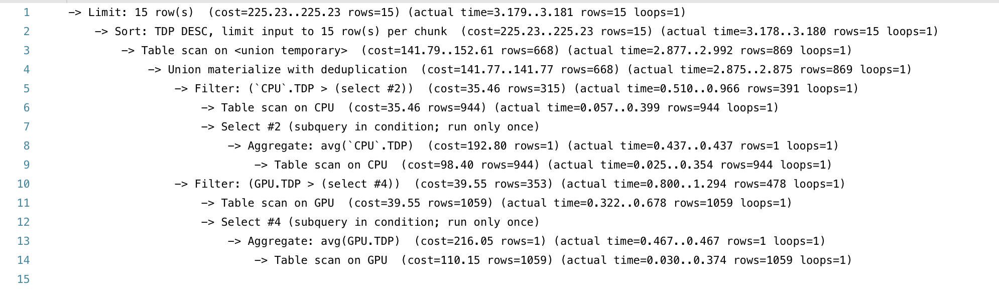
Similar to ```CPU.Manufacturer```, the cost of these operations remain the same since the index of ```Manufacturer``` cannot directly affect the performance of the query. 

##### Selected index: ```None```
Based on the analysis, we shouldn't add any indexes for this query. Indicec on ```TDP``` further increased the cost from 225.23 to over 300 due to the duplication in order and union operation and the additional overhead of maintaining and scanning the indexes. ```TDP``` values can be duplicated, so adding index on ```TDP``` isn't a good choice. For the index on ```Manufacturer```, since ```Manufacturer``` values are used only in select operation and not involved in filtering, joining such operations which will be benefited from index, the index for manufacturer cann't directly affect the performance. Therefore, adding index on manufacturer isn't a good choice and even increase the cost of maintaining and scanning the index.